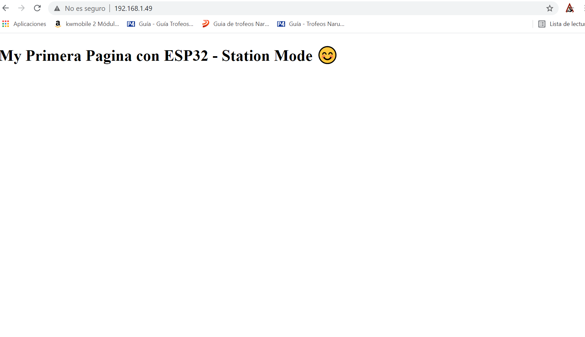
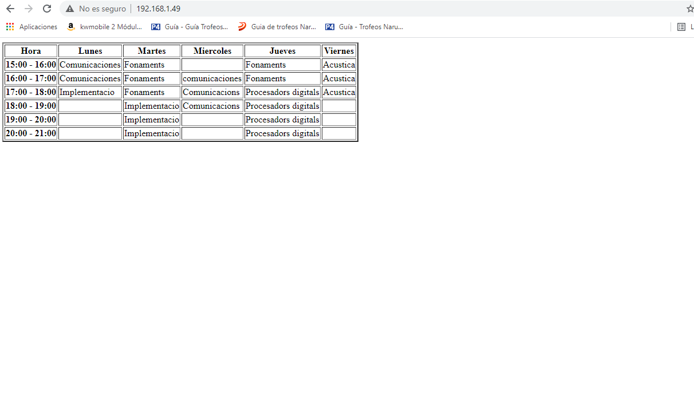

# PRACTICA 3 
### PARTE 1:
Siguiendo la programacion que se nos proporciona para realizar la practica lo primero que nos encontramos es una declaracion de dos variables constantes de caracteres las cuales una de ellas es la ssid (nombre de nuestro wifi) y la otra sera la contraseña de este para posteriormente poder conectar la esp32 a este y por ultimo entes de finalizar las declaraciones encontramos el webserver el cual usaremos para hacer uso de todas sus funciones internas y conectarnos al wifi a más que esta variable es usada para declarar en el puerto donde estara el servidor por tal de acceder a el sin tener que especificar el puerto de la URL, le pondremos el puerto 80 ya que es predeterminado para HTTP. 
Seguidamente nos encontramos con el comando handle_root(void) la cual nos buscara la ruta principal, es decir la direccion IP, donde estara situada nuestra pagina de modo local en nuestro wifi.
Continuado el programa nos encontramos el set up de este en el cual hay un conjunto de instucciones empezando por una la cual esta presente en todo ellos, o en la mayoria, que es el serial begin a la misma velocidad que tenemos puesta la del monitor en el .ini, seguidamente dos prints de dos frases que se mostraran en la terminal/monitor. Posteriormente nos encontramos con las funcionalidades más importantes del programa, ya que seran las encargadas de conectarse al wifi, primero nos encontramos wl wifi.begin con los parametros del ssid (nombre del wifi) y la contraseña de este ya que este comando sera el encargado de conectar la esp32 al wifi, seguidamente nos encontramos con un bucle el cual se mantendra imprimiendo un punto por el monitor/terminal cada segundo más o menos (delay de 1000 ) hasta que el estado del wifi (wifi.status) del esp32 no se encuentre conectado a el. Para finalizar el set up una vez a pasado por lo explicado muestra por el terminal que se a conectado correctamente al wifi y mostrara la ip donde se encuentra el espacio de la esp32 y por ella nuestra pagina de modo local a traves del comando wifi.localIP(), el segudo de comandos despues de este, es decir el server.on a traves del parametro del handle_root y el sever.begin() hacen que nuestro servidor HTTP sea encendido para poder accer correctamente a la paguina hecha a traves de HTML programada posteriormente y por ultimo nos encontramos el mensaje donde nos indica que estre a sido iniciado correctamente.
En penultimo lugar del programa nos encontramos el loop de este donde dentro de el nos encontramos el comando server.handleClient() el cual realiza las funcuines necesarias del servidor y llamar a la funcion de devolucion de llamada correspondiente.
En ultimo lugar nos encontramos la declaracion de una variable string denominada HTML en la cual la asignaremos toda la programacion de la pagina en idioma HTML que queremos que se muestre en nuestra paguina, una vez declarada esta para finalizar el programa podemos ver que el handle_root se trataba de una funcion la cual ejecuta el comando de serve.send(200,"text/html",HTML); el cual sirve para abrir la paguina de forma correcta a traves del primer parametro, es decir el 200, seguido de lo que se muestra en ella en este caso el codigo HTML que queremos mostrar en esta.

Lo que podemos observar a traves de la terminal/monitor son lo esmentado en la explicacion del programa, es decir , como se intenta conectar al wifi la verificacion si este se a conetado correctamete la ip de nuestra paguina de manera local y por ultimo la inicializacion del sirvidor HTTP.
Por otra banda lo que vemos si ponemos esa ip en nuestro navegador es lo que hemos programado en la variable HTML en ese idioma.

Modificando el codigo HTML:

